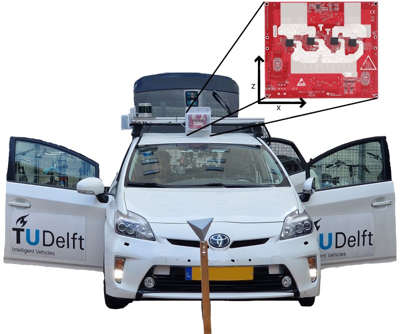

  

# RaDelft Dataset

This repository shares the documentation for the RaDelf dataset as well as the code for reproducing the results of [1].

 
<b>Example video from our dataset, with the camera on top, lidar on the right and the point cloud from [1] on the left.</b>

## Overview
- [Introduction](#introduction)
- [Sensors and Data](#sensors-and-data)

- [Access](#access)
- [Getting Started](#getting-started-examples-and-demos)
- [Annotation](#annotation)
- [License](#license)
- [Citation](#citation)
- [Original paper](Coming Soon)

## Changelog

## Introduction

The RaDelft dataset is a large-scale, real-life multi-sensor dataset recorded in various driving scenarios. It provides radar data in different processing levels, synchronised with lidar, camera and odometry.

## Sensors and data
The output of the next sensors have been recorded:

- A texas instruments MIMO radar board MMWCAS-RF-EVM mounted on the roof.
- A RoboSense Ruby Plus Lidar (128 layers rotating lidar) mounted on the roof.
- A video camera mounted on the windshield (1936 x 1216 px, ~30Hz).
- The ego vehicle’s odometry (filtered combination of RTK GPS, IMU, and wheel odometry, ∼100 Hz).

All sensors were jointly calibrated. See the figure below for a general overview of the sensor setup.

## Access
The dataset is made freely available for non-commercial research purposes only. Eligibility to use the dataset is limited to Master- and PhD-students, and staff of academic and non-profit research institutions. The dataset is hosted in 4TU.ResearchData:

[Link to request access](https://docs.google.com/forms/d/1whyNTiAsZ4l0ENwFiut4yb3FzF3yPjKCdH42OMTlaEk/)

By requesting access, the researcher agrees to use and handle the data according to the [license](LICENSE.md). See furthermore our [privacy statement](docs/privacy.md).

After validating the researcher’s association to a research institue, we will send an email containing password protected download link(s) of the RaDelft dataset. Sharing these links and/or the passwords is strictly forbidden (see licence).

In case of questions of problems, please send an email to i.roldanmontero at tudelft.nl.

**Frequently asked questions about the license:**

**Q**: Is it possible for MSc and PhD students to use the dataset if they work/cooperate with a for-profit organization?

**A**: The current VoD license **permits** the use of the VoD dataset of an MS/PhD student on the compute facilities (storing, processing) of his/her academic institution for research towards his/her degree - even if this MS/PhD student is (also) employed by a company.
The license **does not permit** the use of the VoD dataset in the computing facilities (storage, processing) of a for-profit organization.

## Getting Started: Examples and Demos

### 1_frame_loader - Frame Loader
This example shows how to generate the dataloader for the single and multiframe versions.

[Link To the Jupyter Notebook](https://github.com/RaDelft/RaDelft-Dataset/blob/main/machine_learning_python/examples/1_frame_loader.ipynb)

### 2_3d_visualization - 3D Visualization
This example notebook shows how to load the plot of the 3D point clouds of the lidar and radar with the NN detector.

[Link To the Jupyter Notebook](https://github.com/RaDelft/RaDelft-Dataset/blob/main/machine_learning_python/examples/2_3d_visualiser.ipynb)

> [!NOTE]
> Not all scenes have the point clouds generated by the network. Please, read next section.
### 3_label_visualization - Visualization of automatic and manual labelling results & corresponding RGB images
This notebook example shows the visualization of automatically generated labels and a comparison to manual labels at a specific frame.

[Link To the Jupyter Notebook](https://github.com/RaDelft/RaDelft-Dataset/blob/main/machine_learning_python/examples/3_label_visualization.ipynb)

## Point Clouds
Only the point clouds for scenes 2 and 6 are provided for the network since scenes 1,3,4,5 and 7 are used for training. If the network-generated point clouds are needed for the training scenes, the pre-trained models available with the data can be used to generate the point clouds. To do it, call the *generate_point_clouds* method of network_time.py setting *params["test_scenes"]* equal to  [1,2,3,4,5,6,7]. The only change is to point to the path of the pre-trained network checkpoint available at the data repository.

> [!WARNING]  
> Velocity saved in the point clouds does not use the maximum Doppler unambiguous algorithm. To use the extension, all the Doppler cubes must be generated, which will take up too much space in the data repository. To generate the matrices, the file *generateRadarCubeFFTs.m* can be run with the saveDopplerFold parameter equal to 1. Then, the path to the Doppler folder can be passed in the *cube_to_pointcloud* function in *data_preparation.py*. Moreover, the current algorithm for unambiguous Doppler extension is only valid when a single target occurs in a range-Doppler cell.

## Annotation
Point-by-point semantic labels with four classes (**scenario objects, vehicles, pedestrians, and bicycles**) are generated automatically through the designed automatic labelling process. Generated labels are in the cube format with the same timestamp as the LiDAR point clouds. These labels are stored in the RaDelft dataset hosted in 4TU.ResearchData.

The details of the labelling method are in a paper currently under review for the ICASSP 2025.

## License
* The development kit is realeased under the Apache License, Version 2.0, see [here](LICENSE.txt).
* The dataset can be used by accepting the [Research Use License](LICENSE.md).

## Citation
> [!Important]  
>  The paper explaining in detail all the content of the repository is under review at IEEE Transactions on Radar Systems. The pre-print can be found at:
> https://arxiv.org/abs/2406.04723
